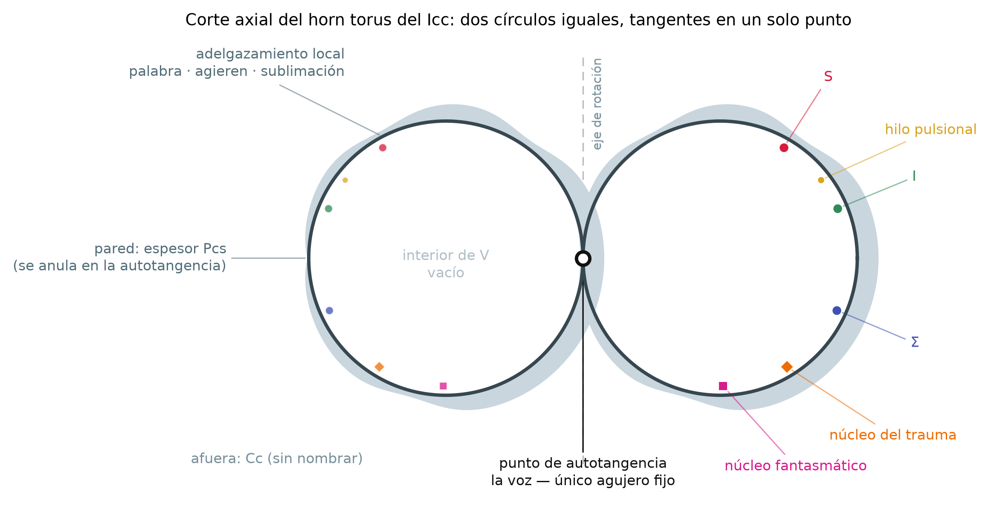

# horn-torus-icc-experimental-2

Modelo topológico del inconsciente freudiano: **el horn torus como límite de la
familia de toros de revolución `r → R`**. Continuación de
[`horn-torus-icc-experimental`](https://github.com/Carlitos130/horn-torus-icc-experimental).

Material de trabajo de la tesis *RSI – Poincaré* (Lic. Carlos Vonsik, MN 85130).



---

## Qué agrega respecto del repo anterior

| | |
|---|---|
| `familia_horn_torus.py` | `HornTorusFamilia(r_over_R=…)`: la familia completa, con los invariantes en forma cerrada (área, volumen, curvatura de Gauss, curvatura media, energía de Willmore) en lugar de los valores fijados a mano |
| `diagramas_icc.py` | las ocho figuras del capítulo y dos visores interactivos (`html_interactivo()`, `html_familia()` con deslizador sobre `r/R`) |
| `md_a_docx.py` | conversor de los documentos en markdown a `.docx`, con figuras y tablas |
| `docs/` | el capítulo y los tres documentos de trabajo, con el estatuto de cada afirmación |

`horn_torus_experimental.py` es **copia sin modificar** del repo anterior:
`HornTorusFamilia` se escribió como subclase aditiva para no tocar el motor. Con
`r_over_R = 1.0` reproduce sus salidas de forma idéntica — superficie, las cuatro
cintas y el punto de fantasía, verificado con `np.allclose`.

## Dos correcciones al planteo anterior

1. **El horn torus (`r = R`) no es una variedad.** La parametrización colapsa
   toda la longitud interior `λ_int = {v = π}` al origen: el objeto límite es
   `T²/λ_int ≅ S²` con dos puntos identificados. `χ` pasa de `0` a `1` y `H₁` de
   `Z²⟨μ,λ⟩` a `Z⟨μ⟩`. Los enunciados de género valen para todo miembro `r < R`,
   no para el límite.
2. **`willmore_energy_standard = 2π²` no es el valor del horn torus** sino el del
   toro de Clifford (`r/R = 1/√2`), que es el mínimo de `W` sobre la familia. En
   `r → R`, `W → ∞`.

## Uso

```bash
pip install -r requirements.txt
python diagramas_icc.py        # genera las ocho figuras y los dos .html
python familia_horn_torus.py   # imprime los invariantes por régimen
```

```python
from familia_horn_torus import HornTorusFamilia
m = HornTorusFamilia(r_over_R=0.9)
print(m.resumen_geometrico())
m.invariantes()["willmore"]
```

## Disciplina de estatutos

Los documentos de `docs/` marcan cada afirmación: **CITA** (verificada contra el
original alemán o francés, con ubicación), **LECTURA** (resonancia sin
confirmar), **AXIOMA** (construcción propia), **PENDIENTE** (pregunta abierta) y
**HECHO MATEMÁTICO** (teorema, no elaboración propia). Las citas alemanas están
transcriptas de los volúmenes, no de traducciones; los números de los documentos
se recalculan desde el código, no se copian.

## Documentos

- `docs/capitulo_horn_torus_icc.md` — el capítulo completo; el §14 lista lo que
  queda abierto
- `docs/seccion16_familia_limite.md` — la reescritura del §4.7/§16
- `docs/formalizacion_trauma_fantasma.md` — trauma como marca, fantasía como
  punción, y los dos mecanismos de la angustia
- `docs/leyenda_diagramas.md` — estatuto de cada elemento dibujado

## Advertencia sobre el módulo psicométrico

El acoplamiento con el SCL-90-R que hereda el motor tiene constantes libres y una
asignación escala→coordenada que no se deriva de nada, y algunas magnitudes que
informa como invariantes topológicos están fijadas a mano. **No tiene valor
diagnóstico y no debe usarse para ninguna decisión clínica**; está acá como
parametrización ilustrativa. Ver el §14.5 del capítulo.

## Licencia

La del repo anterior (`LICENSE`).
