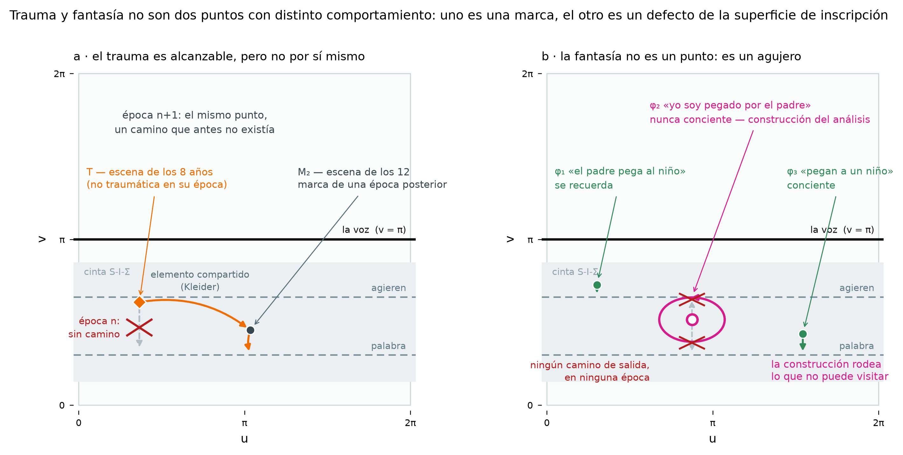
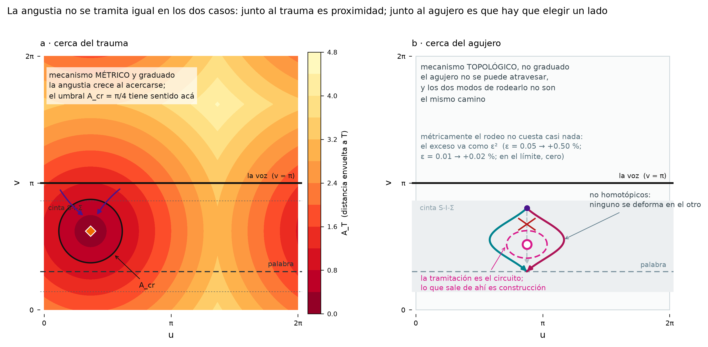

# El trauma y la fantasía: de "dos puntos fijos" a una marca y un agujero

*Propuesta de reescritura del §17 del resumen v7, a partir de los dos casos que
señalaste: Emma (Entwurf, 1895) y «Ein Kind wird geschlagen» (1919).
Disciplina CITA / LECTURA / AXIOMA / PENDIENTE.*

---

## 1. Lo que cambia

El §17 tiene hoy **dos puntos fijos** con comportamiento distinto: el núcleo del
trauma, resoluble, y el núcleo fantasmático, indestructible. Pero "dos puntos
que se comportan distinto" no es una diferencia estructural: es una diferencia
de rótulo. Los dos casos que traés la convierten en una diferencia de
naturaleza.

> **AXIOMA (reformulado).** El núcleo del trauma es una **marca** de la cara
> interna. El núcleo fantasmático **no es una marca**: es un **punto quitado** de
> la cara interna — un agujero de la superficie de inscripción.
>
> La asimetría deja de estipularse. Uno es un elemento de la superficie y el
> otro es un defecto de la superficie, y de ahí se sigue —no se declara— que uno
> sea resoluble y el otro indestructible.

---

## 2. Emma: el trauma es alcanzable, pero no por sí mismo

**CITA — verificada contra el alemán.** Freud, *Entwurf einer Psychologie*
(1895), parte II «Psychopathologie der Hysterie», § *Das hysterische πρῶτον
ψεῦδος*, en *Aus den Anfängen der Psychoanalyse* (1950), **pp. 432–435**.

Las dos escenas, en las palabras de Freud:

> **Escena I — los 12 años** (p. 432): *«Emma steht heute unter dem Zwange, daß
> sie nicht allein in einen Kaufladen gehen kann. […] Sie ging in einen Laden
> etwas einkaufen, sah die beiden Kommis, von denen ihr einer in Erinnerung ist,
> miteinander lachen, und lief in irgendwelchem Schreckaffekt davon.»* — y los
> pensamientos que se despiertan: *«daß die beiden über ihr Kleid gelacht»*.
>
> **Escena II — los 8 años** (pp. 433–434): *«Als Kind von 8 Jahren ging sie
> zweimal in den Laden eines Greißlers allein, um Näschereien einzukaufen. Der
> Edle kniff sie dabei durch die Kleider in die Genitalien.»*
>
> Y la composición, explícita (p. 434): *«Wir verstehen nun Szene I (Kommis)
> wenn wir Szene II (Greißler) dazunehmen.»*

> **La frase decisiva** (p. 435): *«Es liegt hier der Fall vor, daß eine
> Erinnerung einen Affekt erweckt, den sie als Erlebnis nicht erweckt hatte,
> weil unterdes die Veränderung der Pubertät ein anderes Verständnis des
> Erinnerten ermöglicht hat.»*
>
> Glosa propia: *se da aquí el caso de que un recuerdo despierta un afecto que,
> como vivencia, no había despertado, porque en el intervalo la mudanza de la
> pubertad hizo posible otra comprensión de lo recordado.*

**Y hay una segunda frase, en la misma página, que sostiene directamente la
formalización del camino compuesto** — no la había tenido en cuenta:

> **CITA** (p. 435): *«In unserem Beispiel ist aber gerade das bemerkenswert, daß
> nicht jenes Glied ins Bewußtsein tritt, welches ein Interesse weckt (Attentat),
> sondern ein anderes als Symbol (Kleider).»*
>
> Glosa propia: *lo notable en nuestro ejemplo es justamente que no accede a la
> conciencia el eslabón que despierta el interés (el atentado), sino otro, a
> título de símbolo (la ropa).*

Es decir: Freud dice, con esas palabras, que **lo que sale no es la marca que
carga el afecto sino otra, y que sale como símbolo**. El axioma del camino
compuesto `T → M₂ → cruce` deja de ser sólo construcción propia: tiene apoyo
textual directo, y el "elemento compartido" del diagrama es el *Glied als
Symbol* de Freud.

### *Nachträglichkeit*: el sustantivo es de Freud

Esto salió al revés de lo que suponíamos, y a favor tuyo.

> **CITA — verificada.** Freud usa el **sustantivo** *Nachträglichkeit*, no sólo
> el adverbio. Seis veces en *Aus den Anfängen*: cuatro en la p. 247 y una en la
> p. 248 (**Brief vom 14. 11. 97**), y una en la p. 272 (Brief vom 9. 6., donde
> encuentra "el pensamiento de la Nachträglichkeit" en *Gustav Adolfs Page* de
> C. F. Meyer, en el pasaje del beso dormido que le señaló Fliess). Y tres veces
> en **GW XII**: p. 72 —*«Es ist dies einfach ein zweiter Fall von
> Nachträglichkeit»*, en *Aus der Geschichte einer infantilen Neurose*—, otra
> entre pp. 87–89, y la entrada del Sachregister, que confirma la primera:
> *«Nachträglichkeit (Wiederbelebung v. Eindrücken) 72»*.

De la carta del 14.11.97, p. 247, dos frases que importan:

> *«Hat man ein Kind an den Genitalien irritiert, so entsteht Jahre später durch
> Nachträglichkeit von der Erinnerung daran eine weit stärkere Sexualentbindung
> als damals, weil der ausschlaggebende Apparat und der Sekretionsbetrag
> inzwischen gewachsen sind.»*
>
> *«So gibt es eine nicht neurotische Nachträglichkeit normaler Weise, und aus
> ihr entsteht der Zwang. (Unsere anderen Erinnerungen wirken sonst nur, weil
> sie als Erlebnisse gewirkt haben.)»*

El paréntesis es el que sostiene la formalización: **los demás recuerdos actúan
sólo porque actuaron como vivencias.** La *Nachträglichkeit* es justamente la
excepción a eso — un recuerdo que actúa sin haber actuado antes. Traducido al
modelo: la alcanzabilidad de una marca no queda fijada en el momento de la
inscripción.

Consecuencia para la redacción: podés citar el sustantivo en Freud con
ubicación exacta. Laplanche y el *après-coup* lacaniano elaboran el concepto,
pero no acuñan la palabra, y conviene que el texto diga eso en lugar de
atribuirles el término.

### Formalización

> **AXIOMA.** Sea `T` la marca del trauma. La condición de alcanzabilidad **no
> es una propiedad de `T`**, sino del sistema de caminos, y ese sistema cambia
> con cada nueva inscripción:
>
> - en la época `n`: no existe camino de `T` a la pared;
> - en la época `n+1`, depositada `M₂` que comparte borde con `T`: existe el
>   camino compuesto `T → M₂ → cruce`.
>
> El punto no se mueve. **El camino aparece.** Eso es exactamente la estructura
> de la *Nachträglichkeit*, y explica por qué lo que sale por la palabra es la
> otra escena: la salida pasa por `M₂`, no por `T`.

Esto engancha directo con el §9 y con la Carta 52: el camino compuesto atraviesa
una inscripción posterior, es decir una época posterior, y es en el cruce donde
se produce la fecha.

---

## 3. «Ein Kind wird geschlagen»: la fantasía no se alcanza, se rodea

**CITA — verificada contra el alemán.** Freud, *«Ein Kind wird geschlagen»*
(1919), **GW XII, pp. 199–226**; el pasaje de la fase 2 está inmediatamente
antes del encabezado de p. 205, es decir al final de **p. 204**.

Las tres fases de la fantasía en la niña:

| | fase | estatuto en el aparato |
|---|---|---|
| φ₁ | «el padre pega al niño» (al hermano odiado) | se recuerda |
| φ₂ | «yo soy pegada por el padre» | **nunca fue conciente**; es una *construcción del análisis* |
| φ₃ | «pegan a un niño» (impersonal, excitante) | conciente |

Lo decisivo es φ₂, y el texto es más fuerte de lo que recordábamos:

> **CITA** (GW XII, p. 204): *«Ihr Wortlaut ist jetzt also: Ich werde vom Vater
> geschlagen. Sie hat unzweifelhaft masochistischen Charakter. Diese zweite
> Phase ist die wichtigste und folgenschwerste von allen. Aber man kann in
> gewissem Sinne von ihr sagen, sie habe niemals eine reale Existenz gehabt. Sie
> wird in keinem Falle erinnert, sie hat es nie zum Bewußtwerden gebracht. Sie
> ist eine Konstruktion der Analyse, aber darum nicht minder eine
> Notwendigkeit.»*
>
> Glosa propia: *su enunciado es ahora: yo soy pegada por el padre. Tiene sin
> duda carácter masoquista. Esta segunda fase es la más importante y la de mayores
> consecuencias de todas. Pero en cierto sentido puede decirse de ella que nunca
> tuvo una existencia real. En ningún caso se la recuerda, nunca llegó a devenir
> conciente. Es una construcción del análisis, y no por eso menos una
> necesidad.*

Tres cosas, ninguna de las cuales había quedado bien en la versión anterior:

1. La formulación es **«niemals eine reale Existenz gehabt»**, no *reales
   Dasein*; y **«sie hat es nie zum Bewußtwerden gebracht»**, no *niemals bewußt
   geworden*. Conviene citar lo que dice.
2. *«Sie wird in keinem Falle erinnert»* — **en ningún caso se la recuerda**. Eso
   es exactamente la prohibición que el modelo necesita, y es CITA, no axioma.
3. *«aber darum nicht minder eine Notwendigkeit»* — no es una conjetura del
   analista: es una **necesidad**. Es decir, se establece sin ser alcanzada, que
   es justo lo que hace el lazo.

Y la estructura se repite en el varón, lo que da simetría al argumento:

> **CITA** (GW XII, entre pp. 219 y 221): *«Sie hat ein Vorstadium, das
> regelmäßig unbewußt ist und das den Inhalt hat: Ich werde vom Vater
> geschlagen.»* — la fantasía conciente del varón («yo soy pegado por la madre»)
> tiene un estadio previo **regularmente inconciente** con el mismo contenido que
> la fase 2 de la niña.

### Por qué esto obliga a cambiar el §17

Si φ₂ nunca fue conciente y nunca se inscribió como recuerdo, **entonces no es
una marca**. No es una representación reprimida esperando volver: es algo que
el aparato no alojó nunca. Y eso ya no se puede dibujar como un punto de la
cinta.

> **AXIOMA.** El núcleo fantasmático es una **punción** de la cara interna: un
> punto quitado. No hay camino de salida desde él —no porque esté bloqueado,
> sino porque no hay nada ahí de donde partir. Lo que el análisis produce no es
> una visita sino un **lazo**: φ₁ y φ₃ sí son alcanzables, y φ₂ queda
> determinada por el hecho de que el lazo que las une **no se puede contraer**.
>
> Es decir: *la construcción rodea lo que no puede visitar.* Se establece la
> punción por el comportamiento de lo que la circunda, no por haber llegado a
> ella — que es, palabra por palabra, lo que Freud dice que hace la construcción
> en análisis.

> **Condición matemática, y es importante no equivocarla.** Esto vale porque las
> marcas viven en la **cara interna**, que es una superficie: en una superficie,
> un punto quitado se detecta con un lazo no contráctil (π₁ de la cara
> punzada). Si en cambio se pusiera el núcleo en el **interior del toro sólido**
> `V`, un lazo **no** detectaría nada —en tres dimensiones los lazos alrededor
> de un punto sí se contraen— y habría que usar una esfera que lo encierre
> (`H₂`). La formalización del lazo exige que los núcleos estén sobre la cara
> interna, que es donde el §4 ya los pone. Conviene decirlo en el texto, porque
> es la clase de detalle que decide si la escritura formal hace trabajo o es
> decorativa.

---

## 4. Ahora hay tres defectos, y ninguno coincide con otro

El §17 exige que ni el trauma ni la fantasía coincidan con el agujero de la voz.
Con esta reescritura la exigencia se cumple por construcción, porque los tres
son de tipos distintos:

| | qué es | dónde | alcance |
|---|---|---|---|
| **la voz** | el punto donde la superficie **deja de ser una variedad** (la autotangencia del límite `r → R`) | de la superficie misma | universal, estructural |
| **el núcleo fantasmático** | un punto **quitado** de la cara interna; ahí la superficie sí es variedad, salvo por el punto que falta | de la cara interna | singular, por sujeto |
| **el núcleo del trauma** | **no es un defecto**: es una marca, con caminos indexados por época | sobre la cara interna | singular, por sujeto |

---

## 5. Qué prohíbe el modelo ahora

Esto es lo que buscábamos: afirmaciones, no ilustraciones.

1. **No hay camino de salida desde el núcleo fantasmático en ninguna época.** A
   diferencia del trauma, ninguna inscripción posterior puede abrirle uno,
   porque no hay punto de partida. La indestructibilidad deja de ser un adjetivo.
2. **De ahí no puede volver un recuerdo.** Lo que vuelve de ese lugar vuelve como
   construcción, nunca como *Erinnerung* — y esto ya no es sólo consecuencia del
   modelo, es CITA: *«Sie wird in keinem Falle erinnert»*. En la escucha es una
   distinción operativa: un "recuerdo recuperado" de esa región es, en este
   modelo y en esa frase, estructuralmente imposible.
3. **El trauma sí puede volver, pero siempre por otra escena.** La salida es un
   camino compuesto, y por eso lo que se recuerda es la escena posterior.

> **AXIOMA — la angustia se redefine, y queda mejor.** Hoy el modelo tiene un
> solo mecanismo: la distancia al punto de fantasía contra un umbral `A_cr`.
> Con la reescritura son dos fenómenos distintos:
>
> - cerca del trauma: **proximidad** — la pulsión se acerca a una marca;
> - cerca de la fantasía: **no-extensibilidad** — el camino de la pulsión no
>   puede continuarse, porque adelante falta el punto.
>
> Son dos clínicas distintas y el modelo ahora las distingue, en lugar de
> reducirlas a un mismo umbral.

---

## 6. Qué cambiar en el motor

1. **Dos objetos, no dos puntos.** `nucleo_trauma`: una marca `(u_T, v_T)` más la
   marca `M₂` con la que comparte borde y el índice de época en que aparece el
   camino. `nucleo_fantasmatico`: una punción `(u_F, v_F)` — el punto se **quita**
   del dominio, no se marca en él.
2. **La angustia, en dos campos.** `A_trauma(u,v)` = distancia envuelta a la
   marca (ya está en `diagramas_icc.distancia_angular`). `A_fantasma(u,v)` = no
   hay continuación: el campo debe medir bloqueo de camino, no distancia.
3. **La posición del trauma sigue PENDIENTE**, pero ya no es libre: ahora tiene
   una condición que cumplir —debe existir al menos otra marca con la que
   comparta borde, y la salida tiene que pasar por ella—. Eso reduce el espacio
   de elecciones posibles, que es lo que uno quiere de un axioma.

---

## 7. Aparato de citas — estado verificado

Cotejado directamente contra los archivos alemanes del corpus
(*Aus den Anfängen der Psychoanalyse*, 1950; *Gesammelte Werke* XII). Las páginas
salen de los encabezados de página y de los marcadores del propio volumen.

| # | cita | obra / ubicación | estatuto |
|---|---|---|---|
| 1 | *«Es liegt hier der Fall vor, daß eine Erinnerung einen Affekt erweckt, den sie als Erlebnis nicht erweckt hatte…»* | Entwurf, II, § *Das hysterische πρῶτον ψεῦδος* — Aus den Anfängen, **p. 435** | **CITA** |
| 2 | *«…daß nicht jenes Glied ins Bewußtsein tritt, welches ein Interesse weckt (Attentat), sondern ein anderes als Symbol (Kleider).»* | ídem, **p. 435** | **CITA** |
| 3 | Escena I (Kommis, 12 años) / Escena II (Greißler, 8 años) y su composición | ídem, **pp. 432–434** | **CITA** |
| 4 | *«So gibt es eine nicht neurotische Nachträglichkeit normaler Weise… (Unsere anderen Erinnerungen wirken sonst nur, weil sie als Erlebnisse gewirkt haben.)»* | Brief vom 14. 11. 97 — Aus den Anfängen, **p. 247** | **CITA** |
| 5 | *Nachträglichkeit* como sustantivo, otras apariciones | Aus den Anfängen **pp. 247 (×4), 248, 272**; GW XII **p. 72** y entre **87–89** | **CITA** |
| 6 | *«…sie habe niemals eine reale Existenz gehabt. Sie wird in keinem Falle erinnert, sie hat es nie zum Bewußtwerden gebracht. Sie ist eine Konstruktion der Analyse, aber darum nicht minder eine Notwendigkeit.»* | *Ein Kind wird geschlagen* — GW XII, **p. 204** | **CITA** |
| 7 | *«Sie hat ein Vorstadium, das regelmäßig unbewußt ist und das den Inhalt hat: Ich werde vom Vater geschlagen.»* (el varón) | ídem, GW XII, entre **pp. 219–221** | **CITA** |

**Lo que queda por precisar**, y es sólo paginación fina: los encabezados de
página del OCR son ralos en «Ein Kind wird geschlagen» (13 en 27 páginas), así
que la p. 204 de la cita 6 está acotada entre los encabezados 201 y 205 —el de
205 aparece inmediatamente después de la frase—. Lo mismo con las citas 5 (entre
87 y 89) y 7 (entre 219 y 221). Conviene confirmarlas en el ejemplar impreso
antes de la redacción final; las frases alemanas, en cambio, están transcriptas
del archivo, no de memoria.

**Lo que ya no está pendiente:** las tres verificaciones que el §17 tenía
abiertas quedaron cerradas, y una de ellas al revés de lo esperado — el
sustantivo *Nachträglichkeit* es de Freud.

---

## 8. Cómo se tramita la angustia cerca del agujero

### El agujero no cuesta nada métricamente

Primero el cálculo, porque decide el resto. Tomemos una marca `P` y una salida,
alineadas con el agujero, a distancia `0.5` cada una: el camino recto mide `1`.
Si se quita un disco de radio `ε` alrededor del punto, el camino más corto es
tangente–arco–tangente, y su exceso sobre el recto es:

| `ε` | largo del rodeo | exceso |
|---|---|---|
| 0.20 | 1.081122 | +8.11 % |
| 0.10 | 1.020067 | +2.01 % |
| 0.05 | 1.005004 | +0.50 % |
| 0.01 | 1.000200 | +0.02 % |
| 0.001 | 1.000002 | +0.0002 % |

El exceso va como **`ε²`**, no como `ε` —verificado: el cociente
`exceso/ε² → (1/a + 1/b)/2 = 2.0`—. Para una punción verdadera (`ε → 0`) el
costo métrico es **exactamente cero**: el largo del camino recto sigue siendo el
ínfimo, sólo que **no se alcanza**.

> **Consecuencia directa, y es un error de mecanismo, no de parámetro.** El
> umbral `A_cr` —distancia al punto, con ruptura si `A ≤ A_cr`— es un buen
> modelo del **trauma** y un modelo equivocado de la **fantasía**, y el motor lo
> aplica a la fantasía. Está midiendo una magnitud que, en el límite, vale cero.
> Síntoma comprobable en el código actual: mover el punto de fantasía cambia el
> `rupture_count` de manera suave y proporcional, como si el agujero tuviera
> tamaño. No lo tiene.

### Entonces, qué es la angustia ahí

> **AXIOMA.** Junto al trauma la angustia es **proximidad**: crece al acercarse,
> decrece al alejarse, y el umbral tiene sentido. Junto al agujero no es
> proximidad, porque atravesarlo no es caro: es **imposible**, y los dos modos de
> rodearlo **no son el mismo camino** —no son homotópicos, ninguno se deforma en
> el otro—. La angustia es que hay que **elegir un lado** y nada en la superficie
> decide cuál. Angustia como imposibilidad de la indiferencia.

Y de ahí se sigue cómo se tramita:

> **AXIOMA.** Como no se puede pasar, se rodea; y rodear es lo único disponible.
> El circuito **es** la tramitación. Por eso lo que sale de esa región sale como
> construcción y no como recuerdo: el lazo establece la punción sin visitarla
> (§3), y eso es exactamente lo que Freud dice que hace la construcción —
> *«Sie wird in keinem Falle erinnert… Sie ist eine Konstruktion der Analyse»*.

Y una distinción clínica que el modelo ahora produce en lugar de recibir:

> **AXIOMA.** Junto al trauma, alejarse alivia, y la palabra —por la vía
> compuesta `T → M₂ → cruce`— resuelve: eso es la eclosión del §17. Junto al
> agujero, alejarse no alivia del mismo modo, porque la angustia no venía de la
> distancia: se vuelve a presentar cada vez que el circuito pasa. **La
> repetición no es un fracaso de la tramitación: es la forma que la tramitación
> toma ahí.**

> **PENDIENTE — el único punto que la topología no decide.** Cuánta angustia
> es una pregunta métrica, y la topología sólo contesta sí o no. Para tener un
> campo graduado alrededor de la punción hace falta una decisión de modelo
> adicional —un `ε` finito, o un radio de giro máximo para el recorrido
> pulsional—, y esa decisión hay que justificarla, no elegirla por conveniencia
> numérica. Mientras no esté tomada, el modelo afirma la **clase** del fenómeno
> junto al agujero y la **magnitud** sólo junto al trauma.

### Qué cambiar en el motor, concretamente

4. **`A_fantasma` no es un campo escalar con umbral.** Debe devolver dos cosas:
   un indicador de continuación (¿el camino hacia la salida pasa por la punción?)
   y, si pasa, el lado elegido. La "ruptura" de la fantasía no es un conjunto de
   puntos cercanos, es una condición sobre **trayectorias**.
5. **El conteo de ruptura hay que separarlo en dos.** Hoy `rupture_count` mezcla
   los dos mecanismos en un solo número; con la reescritura son magnitudes de
   distinta naturaleza y no deberían sumarse.
